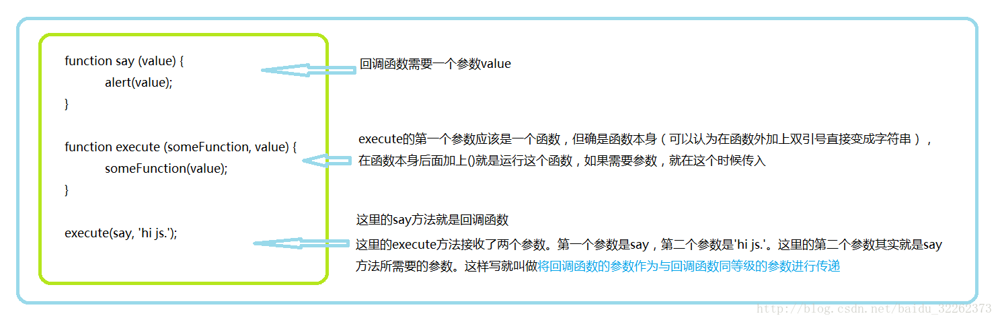
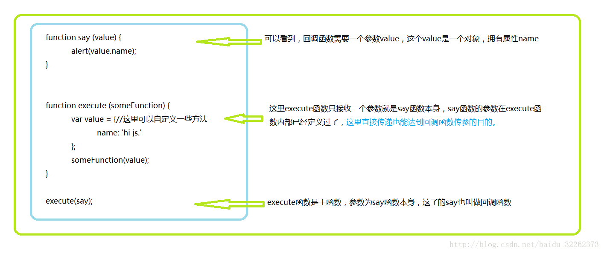

<!-- @import "[TOC]" {cmd="toc" depthFrom=1 depthTo=6 orderedList=false} -->
<!-- TOC -->

- [一、前奏](#一前奏)
- [二、js中函数可以作为参数传递](#二js中函数可以作为参数传递)
- [三、回调函数易混淆点——传参](#三回调函数易混淆点传参)
- [四、写在最后](#四写在最后)

<!-- /TOC -->
# 一、前奏

在谈回调函数之前，先下面两段代码：

不妨猜测一下代码的结果。
```js
  ● function say (value) {

  ●     alert(value);
  ● }

  ● alert(say);
  ● alert(say('回调函数'));
```
如果你测试了，就会发现：
```html
  ● 只写变量名  say   返回的将会是 say方法本身，以字符串的形式表现出来。
  ● 而在变量名后加()如say()返回的就会使say方法调用后的结果，这里是弹出value的值。
```

# 二、js中函数可以作为参数传递

再看下面的两段代码：
```js
  ●  function say(value) {
  ●  	alert(value);
  ●  }
  ● function execute(someFunction, value) { 
  ●  	someFunction(value);
  ●  }
  ● execute(say,"回调函数");
```
与
```js
  ●  function execute(someFunction,value) {
  ●  	someFunction(value);
  ● }
  ●  execute(function(value){ alert(value);}, "回调函数" )
```
上面第一段代码是将say方法作为参数传递给execute方法

第二段代码则是直接将匿名函数作为参数传递给execute方法

实际上：
```js
  ● functionsay(value) {
  ● alert(value);
  ● }
  ● // 注意看下面,直接写say方法的方法名与下面的匿名函数可以认为是一个东西
  ● // 这样再看上面两段代码是不是对函数可以作为参数传递就更加清晰了
  ● say;
  ● function(value) {
  ● alert(value);
  ● }
```
这里的say或者匿名函数就被称为<strong>回调函数</strong>。

# 三、回调函数易混淆点——传参

如果回调函数需要传参，如何做到，这里介绍两种解决方案。

  ● 将回调函数的参数作为与回调函数同等级的参数进行传递
  

  ● 回调函数的参数在调用回调函数内部创建
  
# 四、写在最后

回调函数应用场景多用在使用 js 写组件时，尤其是<strong>组件的事件很多都需要回调函数的支持</strong>。