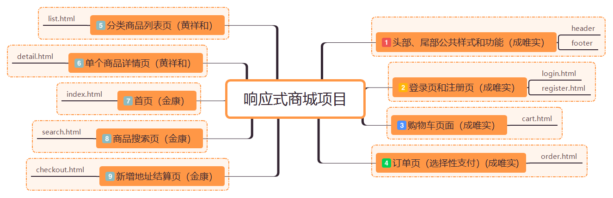

# 响应式商城项目说明

## 一、项目介绍

运用html、CSS3、javascript、jQuery框架、bootsrapt框架综合的前端技术和后台接口完成一个电商商城的响应式布局。同时，具有用户注册、登录（取消登录）、查看分类商品、搜索商品、查看单个商品详情、选择商品数量添加到购物车、去购物车下订单、新增收货地址进行结算、订单选择性支付和查看的一系列功能。

## 二、项目小组及任务分配

组员：黄祥和（组长）、成唯实、金康

任务分配：

1. 黄祥和：

(1)商品分类列表页布局，实现页面排布某分类下的20件商品、鼠标移入商品图片有放大及添加边框，点击下方按钮能进行翻页跳转。

(2)单个商品详情页布局雏形，实现展示商品的放大镜功能，下方多图点击轮播，添加分享、收藏按钮，右方商品品名、货号、价格的获取、款式筛选、数量变更等功能。

(3)详情页商品添加到购物车功能，同类商品推荐、热销商品排行、商品详情菜单栏布局及详情内容展示，尺寸展示，评论展示，猜你喜欢商品推荐。

2. 成唯实部分：

(1) <strong>注册页面</strong>：注册页面主要根据响应式效果，屏幕缩放时增加了一些动画特效，比如“圣诞快乐”跳出动画，注册页面的功能主要有查询用户名是否注册，密码两次输入（密码长度验证），以及验证码功能，只有当几者全部符合时才能注册成功。

(2)<strong>登录页面</strong>：检测用户是否已登录，跳出弹框提示。然后就是简单的登录功能，主要的还是页面排版。

(3)<strong>所有页面头部</strong>：包含logo的制作，搜索框功能，用户是否登录的状态检测，取消登录，订单数量查询，购物车内容获取（数量，缩略图，商品名称等等）。

(4)<strong>所有页面尾部</strong>：尾部功能比较单一，结合响应式布局增加了页面的美观性和充实性，侧边栏有固定的客服、回到底部等样式。

(5)<strong>购物车页面</strong>：购物车，下订单和结算页头部样式的统一制作，关于购物车内容，实现了全选、单件商品数量加减（输入框输入）、删除商品、选择性删除等等一系列功能，比较完善。

(6) <strong>结算页面</strong>：结算页面可以查看所有的订单，然后可以选择性支付其中的订单（有全选和单选功能），点击支付按钮跳出弹框实现已支付所选中的订单总额。 

3. 金康：
（1）主页
    **轮播图**  用Bootstrap实现轮播图, 功能有自动播放,点击左右按钮切换图片及 下方小按钮点击切换图片
    **购物中心**  hover事件 点击锚点功能
    **购物中心产品展示**     hover事件 显示产品价格 产品名字和 介绍等功能

（2）搜索页
    **点击搜索**   获取地址上后面的字符,首页搜索跳到搜索页时字符会在地址栏转码,注意获取字符时记得转码回来，搜索出来的产品 hover事件  点击跳转详情页

（3）checkout页面
**添加地址**      点击添加地址
**删除**          删除键 删除 选中地址简单的效果 点击跳转到结算界面
    等等。

4. 组长完成所有页面及相应css、js文件的整合，并和组员集体讨论解决残留的bug。

## 三、项目完成度

相关页面及功能基本完成，基本匹配响应式布局。
